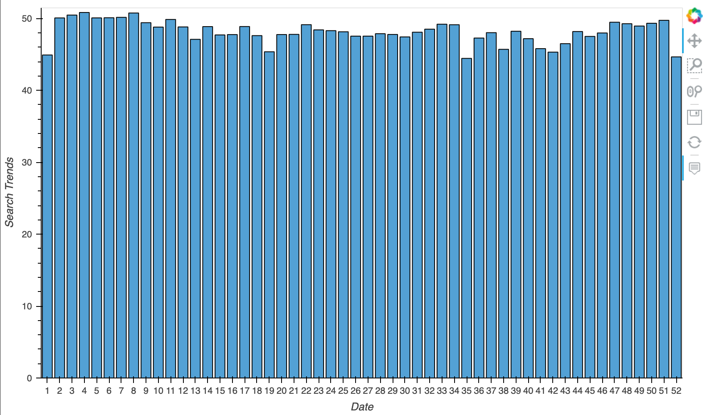

# forecasting_net_prophet
Module 11

**The application is published [here](https://github.com/avangelinac/forecasting_net_prophet) as a github project page.**

---
## Installation Instructions

1. Clone the repo
   ```sh
   git clone https://github.com/avangelinac/forecasting_net_prophet.git
   ```

2. You don't need to install pip - Conda comes with pip and you can also use the command
    conda install 'package name'
   
3. Install Conda according to the instructions based on your operating system.
    For windows users you MUST use the Administrator PowerShell. Users with AMD Processors MUST use the Administrator PowerShell 7 (X64) version
  
    Once installed Conda has an Admin PowerShell version shortcut - look on your Start menu for it.
    This shortcut will prove very useful at times when you need to install other apps or make adjustments to your installation

    Once installed you will see (base) on your terminal
   
4. Activate Conda Dev environment
   ```sh
   conda activate dev
   ```
   You should now see (dev) on your terminal

5. Install JupyterLabs
   ```sh
   pip install jupyterlab
   ```

6. Run JupyterLabs
   ```sh
   jupyter lab
   ```
   A browser window should open on localhost:8888/lab

---
## Usage

* [Python](https://www.python.org/)
* [Python CSV Reading/Writing](https://docs.python.org/3/library/csv.html)
* [Python pandas](https://pandas.pydata.org/)
* [Python hvplot.pandas](https://hvplot.holoviz.org/index.html)
* [Python conda](https://docs.conda.io/projects/conda/en/latest/user-guide/install/index.html)
* [Python JupyterLab](https://jupyter.org/)

---
## Examples
- ### Chart 1

- ### Chart 2 

- ### Chart 3

- ### Chart 4

- ### Chart 5

- ### Chart 6

- ### Chart 7 

- ### Chart 8

- ### Chart 9

- ### Chart 10

- ### Chart 11

- ### Chart 12 

- ### Chart 13


---
## Contributors
Initial Avangelina Cazares. 

---
## Disclaimer
Not financial advice

---
## License
None & Open Source